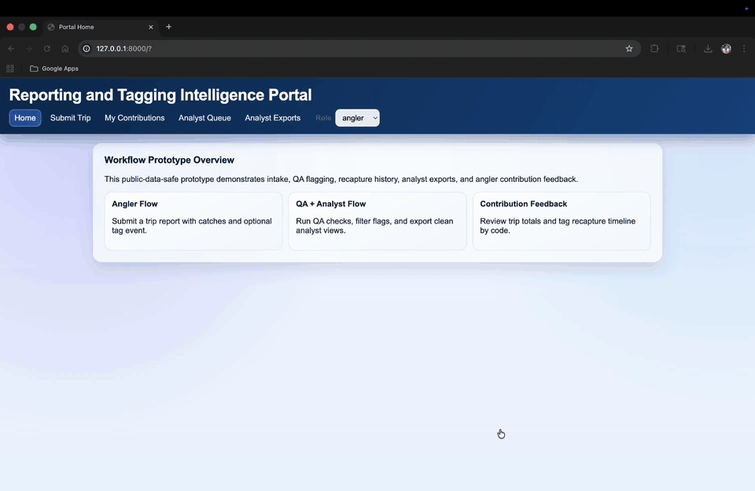
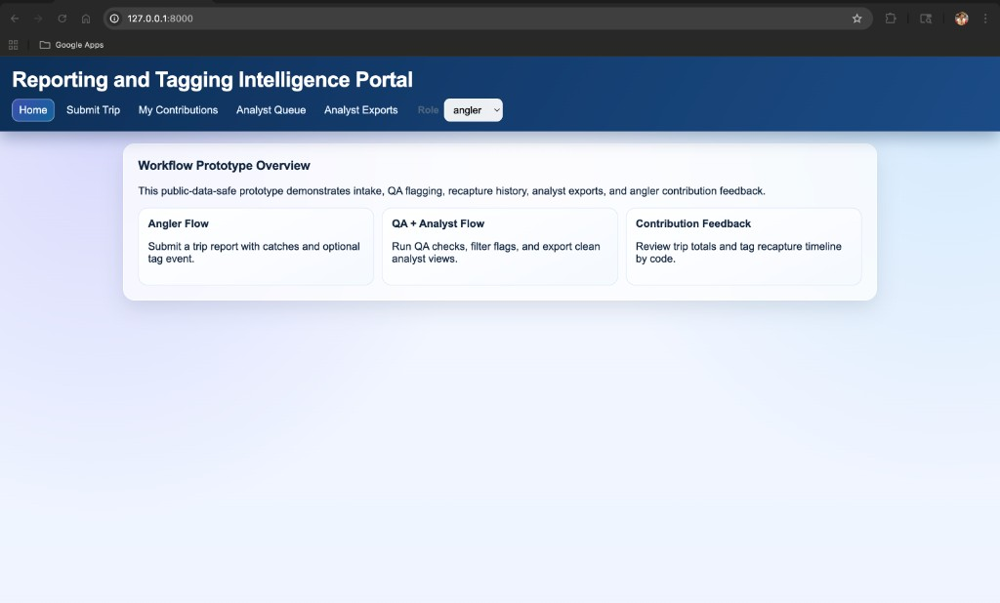
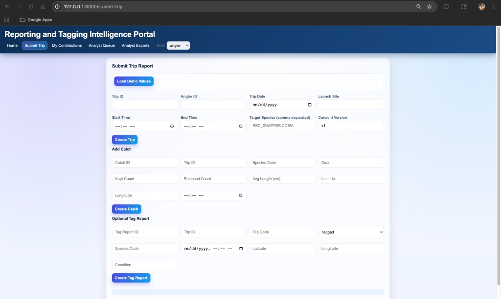
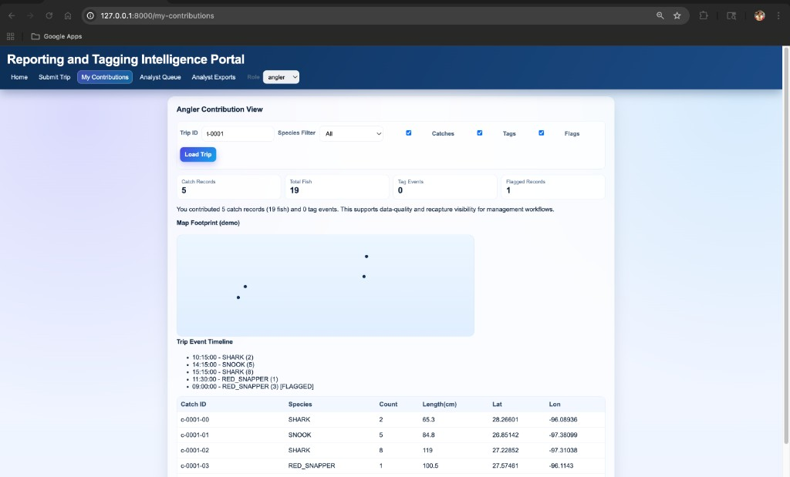
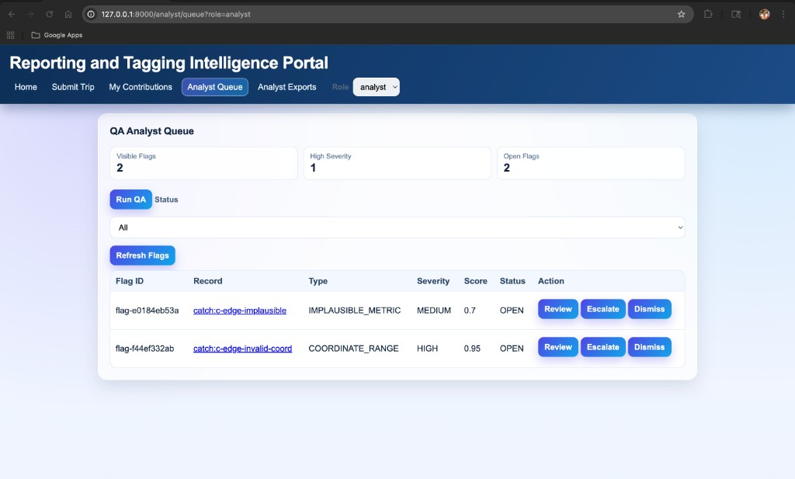
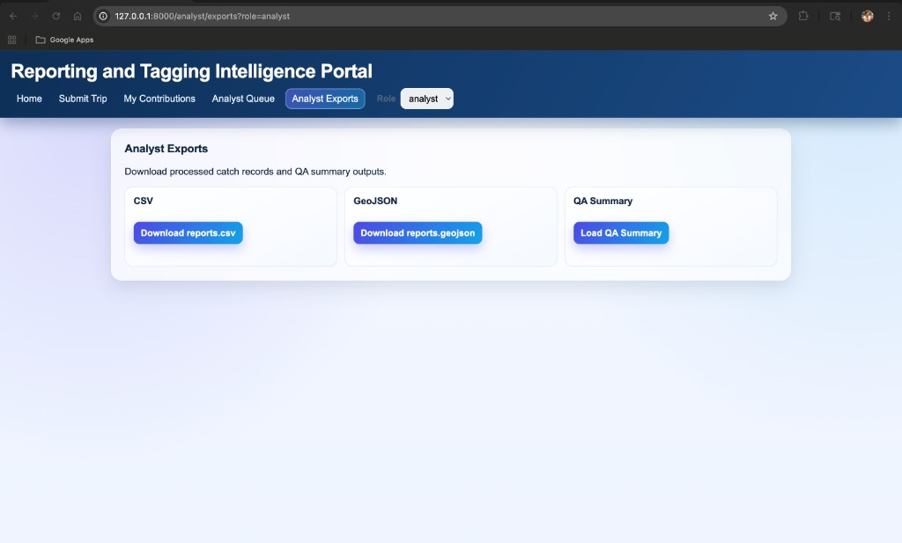
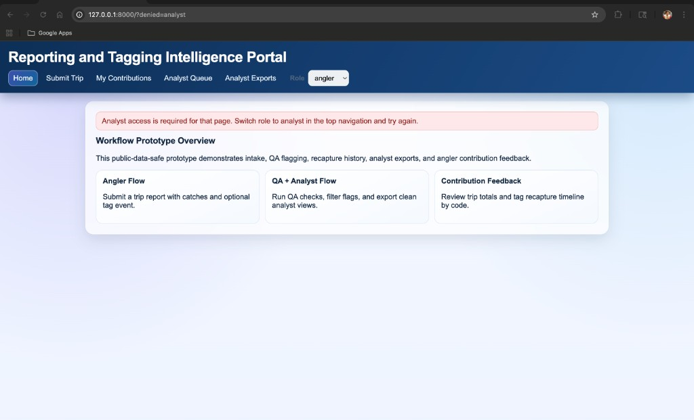
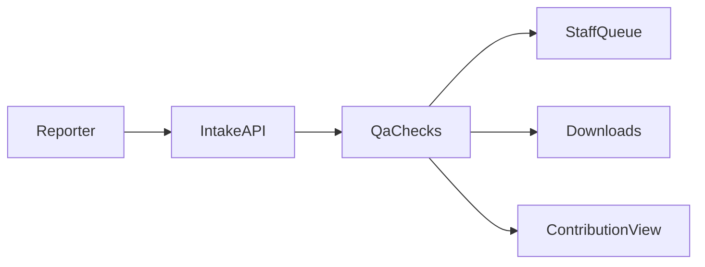

# sportfish-reporting-qa-demo


Sportfish reporting QA workflow demo — data intake, validation, structured export (public-data-safe).

The on-screen product name in the demo UI remains **Reporting and Tagging Intelligence Portal** so screenshots and screen recordings stay consistent.

## Demo media

End-to-end UI built with **FastAPI + SQLite + static HTML** (`uvicorn api.main:app`). Demo uses **synthetic data only**.

### Walkthrough GIF

Full portal walkthrough (**`assets/gif/portal-end-to-end.gif`**).



### Screenshots

<details>
<summary><strong>Expand: 6 dashboard screenshots</strong> (home → submit → contributions → QA → exports → access banner)</summary>

| Screen | Preview |
|--------|---------|
| Home / overview |  |
| Submit trip flow |  |
| My contributions (map + timeline) |  |
| QA analyst queue |  |
| Analyst exports |  |
| Access / role banner |  |

</details>

**Source recording:** [`assets/Source/portal-demo.mp4`](assets/Source/portal-demo.mp4)

**Regenerating GIFs / ffmpeg:** [`docs/artifact-finalization.md`](docs/artifact-finalization.md)

## Who this is for (60-second read)

If you skim GitHub repos fast, here is the point of this one:

| Question | Answer |
| --- | --- |
| What problem does it solve? | Messy volunteer reports slow teams down—this prototype standardizes intake and highlights likely issues early. |
| What did you build? | A working web demo with reporting forms, QA queue, downloads, and a participant summary view (fake data). |
| How do you prove it quickly? | GIF + screenshots above + setup steps below. |

**Printable one-pager (three panels):** open [`docs/reviewer-one-pager.html`](docs/reviewer-one-pager.html) in a browser → Print → Save as PDF.

## What this helps with

- **Fewer messy records:** coordinates, counts, dates, and duplicates get flagged automatically.
- **Faster reviews:** QA items show up in a queue with actions (review / escalate / dismiss).
- **Better reporting:** downloads are ready as CSV or GeoJSON.
- **Clear participant view:** totals, a simple map footprint, timelines, and tag histories.

This demo uses **fake data only**. It is not measuring fish populations or predicting outcomes.

## Smart helpers (optional)

Some checks can sound "smart," but they only **suggest issues** for a human to confirm. Nothing here replaces expert review.

## What you can view in the demo

| Area | What you see |
| --- | --- |
| Home / overview | Entry point and navigation to the flows below |
| Submit Trip | Forms for trip, catches, optional tag report; success/error messages |
| My Contributions | Trip totals, KPI cards, simple map dots, timeline list |
| Analyst Queue | Flag list, severity, scores, actions |
| Analyst record | Drill-in view for a flagged record (`/analyst/record/{type}/{id}`) |
| Analyst Exports | Download CSV / GeoJSON, QA summary JSON |
| Recapture timeline | Ordered events for a tag code |

## Tech stack

- **Backend:** FastAPI + SQLite (`api/main.py`, `api/db.py`, `api/qa.py`)
- **Frontend:** simple HTML pages (`frontend/*.html`)
- **Demo data:** generated by `api/seed_data.py`



## Run it locally

Run these commands from the **repository root** (the folder that contains `api/` and `frontend/`).

1. Install Python packages:

   ```bash
   python3 -m pip install -r api/requirements.txt
   ```

2. Load demo database + CSV seeds:

   ```bash
   python3 api/seed_data.py
   ```

3. Start the server:

   ```bash
   uvicorn api.main:app --reload --app-dir .
   ```

4. Open:

   `http://127.0.0.1:8000/`

## Pages (browser)

- `/` — home
- `/submit-trip`
- `/my-contributions`
- `/analyst/queue` (requires analyst role; see below)
- `/analyst/exports` (requires analyst role)
- `/analyst/record/{record_type}/{record_id}` (requires analyst role)
- `/recaptures/{tag_code}`

**Role:** use the **Role** dropdown in the top bar (`angler` vs `analyst`). That sets `?role=analyst` in the URL (and a stored preference) so analyst pages load correctly. For direct API calls, you can send the header `x-role: analyst` on analyst-only endpoints.

## API (same app)

**Intake & read (no special role)**

- `POST /api/v1/trips`
- `POST /api/v1/catches`
- `POST /api/v1/tag-reports`
- `GET /api/v1/trips/{trip_id}`
- `GET /api/v1/trips/{trip_id}/layers` — map/timeline layers for contributions view (optional filters: `species`, `includeFlags`, `includeTags`)
- `GET /api/v1/tag-reports/{tag_code}/history`

**Demo helpers**

- `GET /api/v1/demo/ids` — sample IDs for a quick UI walkthrough

**Analyst role** (`x-role: analyst` or `?role=analyst` where applicable)

- `POST /api/v1/qa/run`
- `GET /api/v1/qa/flags`
- `PATCH /api/v1/qa/flags/{flag_id}`
- `GET /api/v1/records/{record_type}/{record_id}`
- `GET /api/v1/exports/reports.csv`
- `GET /api/v1/exports/reports.geojson`
- `GET /api/v1/exports/qa-summary.json`

See [`docs/data-provenance.md`](docs/data-provenance.md) for what "fake data" means here.

## Synthetic dataset (included)

Running `python3 api/seed_data.py` fills `data/mock/` with repeatable sample trips, catches, tags, plus a SQLite file for local runs.

## Honest limits

This is a demo for showing how intake + checks + downloads could work together. Do not use it as proof about real-world fish numbers or rules.
