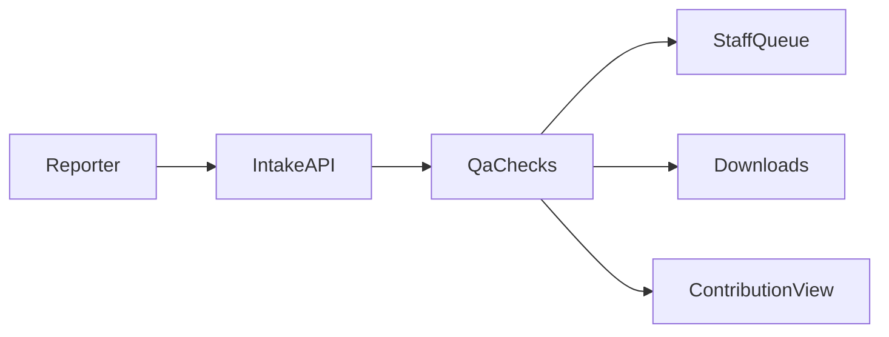

# sportfish-reporting-qa-demo

Sportfish trip reporting QA demo — a small website where people submit fishing trips and optional tag notes, staff review flagged items, and downloads go out as CSV or GeoJSON (fake sample data).

The on-screen product name in the demo UI remains **Reporting and Tagging Intelligence Portal** so screenshots and screen recordings stay consistent.

## Who this is for (60-second read)

If you skim GitHub repos fast, here is the point of this one:

| Question | Answer |
| --- | --- |
| What problem does it solve? | Messy volunteer reports slow teams down—this prototype standardizes intake and highlights likely issues early. |
| What did you build? | A working web demo with reporting forms, QA queue, downloads, and a participant summary view (fake data). |
| How do you prove it quickly? | Screenshots + GIF + setup steps below. |

**Printable one-pager (three panels):** open [`docs/reviewer-one-pager.html`](docs/reviewer-one-pager.html) in a browser → Print → Save as PDF.

## Packaging notes (GitHub profile)

Recommended public repo name (short + clear):

`sportfish-reporting-qa-demo`

Suggested GitHub bio line examples:

- “Research-style data tools · trip reporting demos · QA + GIS-friendly exports”
- “Demo apps for outdoor reporting workflows (QC, maps, CSV/GeoJSON)”

Keep claims practical: workflow software that supports intake + review + downloads—not stock estimates.

## What this helps with

- Fewer messy records: coordinates, counts, dates, and duplicates get flagged automatically.
- Faster reviews: QA items show up in a queue with actions (review / escalate / dismiss).
- Better reporting: downloads are ready as CSV or GeoJSON.
- Clear participant view: totals, a simple map footprint, timelines, and tag histories.

This demo uses **fake data only**. It is not measuring fish populations or predicting outcomes.

## Smart helpers (optional)

Some checks can sound “smart,” but they only **suggest issues** for a human to confirm. Nothing here replaces expert review.

## What you can view in the demo

| Area | What you see |
| --- | --- |
| Submit Trip | Forms for trip, catches, optional tag report; success/error messages |
| My Contributions | Trip totals, KPI cards, simple map dots, timeline list |
| Analyst Queue | Flag list, severity, scores, actions |
| Analyst Exports | Download CSV / GeoJSON, QA summary JSON |
| Recapture timeline | Ordered events for a tag code |

## Tech stack

- Backend: FastAPI + SQLite (`api/main.py`, `api/db.py`, `api/qa.py`)
- Frontend: simple HTML pages (`frontend/*.html`)
- Demo data: generated by `api/seed_data.py`

## Run it locally

1. Install Python packages:

   `python3 -m pip install -r api/requirements.txt`

2. Load demo database + CSV seeds:

   `python3 api/seed_data.py`

3. Start the server:

   `uvicorn api.main:app --reload --app-dir .`

4. Open:

   `http://127.0.0.1:8000/`

## Pages (browser)

- `/submit-trip`
- `/my-contributions`
- `/analyst/queue`
- `/analyst/exports`
- `/recaptures/{tagCode}`

Switch **Role** in the top bar: `angler` (reporting) or `analyst` (review + downloads).

## API (same app)

- `POST /api/v1/trips`
- `POST /api/v1/catches`
- `POST /api/v1/tag-reports`
- `GET /api/v1/trips/{tripId}`
- `GET /api/v1/tag-reports/{tagCode}/history`
- `POST /api/v1/qa/run` (analyst role)
- `GET /api/v1/qa/flags` (analyst role)
- `PATCH /api/v1/qa/flags/{flagId}` (analyst role)
- `GET /api/v1/exports/reports.csv` (analyst role)
- `GET /api/v1/exports/reports.geojson` (analyst role)
- `GET /api/v1/exports/qa-summary.json` (analyst role)

See `docs/data-provenance.md` for what “fake data” means here.

## Synthetic dataset (included)

Running `python3 api/seed_data.py` fills `data/mock/` with repeatable sample trips, catches, tags, plus a SQLite file for local runs.

## Screenshots & screen recording

Checklist and ffmpeg tips: `docs/artifact-finalization.md`

- Screenshots folder: `assets/screenshots/`
  - [Home](assets/screenshots/01-home-overview.png)
  - [Submit Trip](assets/screenshots/02-submit-trip-flow.png)
  - [Contributions](assets/screenshots/03-contributions-map-timeline.png)
  - [QA Queue](assets/screenshots/04-qa-analyst-queue.png)
  - [Exports](assets/screenshots/05-analyst-exports.png)
  - [Access note](assets/screenshots/06-access-denied-banner.png)
- Full walkthrough GIF: [portal-end-to-end.gif](assets/gif/portal-end-to-end.gif)  
  (made from `assets/Source/portal-demo.mp4`)

## Honest limits

This is a demo for showing how intake + checks + downloads could work together. Do not use it as proof about real-world fish numbers or rules.
